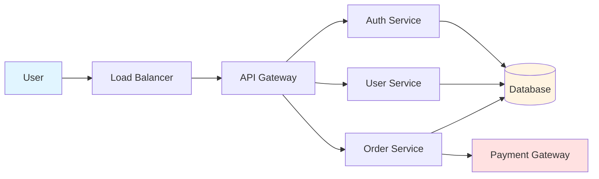

# Threat Modeling Expert

## Overview

Expert in threat modeling methodologies, security architecture review, and risk assessment. Masters STRIDE, PASTA, attack trees, and security requirement extraction for building secure-by-design systems.

## When to Use

- Designing new systems or features
- Reviewing architecture for security gaps
- Preparing for security audits
- Identifying attack vectors
- Prioritizing security investments
- Creating security documentation
- Training teams on security thinking

## Core Methodologies

### STRIDE Threat Analysis

Systematic threat identification by category:

| Threat | Description | Example |
|--------|-------------|---------|
| **S**poofing | Identity theft | Stolen credentials, session hijacking |
| **T**ampering | Data modification | MITM attacks, file modification |
| **R**epudiation | Denying actions | No audit logs, weak authentication |
| **I**nformation Disclosure | Data exposure | Sensitive data in logs, insecure storage |
| **D**enial of Service | Availability attacks | Resource exhaustion, DDoS |
| **E**levation of Privilege | Unauthorized access | Privilege escalation, bypassing auth |

### PASTA (Process for Attack Simulation and Threat Analysis)

7-stage risk-centric methodology:

1. **Define Objectives**: Business goals, security requirements
2. **Define Technical Scope**: Architecture, components, data flows
3. **Application Decomposition**: Identify assets, trust boundaries
4. **Threat Analysis**: Identify threats using threat intelligence
5. **Vulnerability Analysis**: Weaknesses in design/implementation
6. **Attack Modeling**: Simulate attack scenarios
7. **Risk & Impact Analysis**: Prioritize risks, define mitigations

### Attack Trees

Hierarchical representation of attack paths:

```
Goal: Steal User Credentials
├── Path 1: Network Attack
│   ├── MITM Attack
│   │   ├── ARP Spoofing
│   │   └── DNS Poisoning
│   └── Packet Sniffing
│       └── Unencrypted HTTP
└── Path 2: Application Attack
    ├── SQL Injection
    │   └── Login Form
    └── XSS
        └── Stored XSS in Profile
```

## Threat Modeling Process

### Step 1: Define System Scope

```yaml
System: E-commerce Platform
Components:
  - Web Application (React)
  - API Gateway (Node.js)
  - User Service (Python)
  - Payment Service (Java)
  - Database (PostgreSQL)
  - Cache (Redis)

Data Flows:
  - User → API Gateway → Services → Database
  - Payment Service → External Payment Provider

Trust Boundaries:
  - Internet → API Gateway (untrusted → trusted)
  - API Gateway → Services (internal network)
  - Services → Database (data layer)
```

### Step 2: Identify Assets

```yaml
Critical Assets:
  - User credentials (passwords, tokens)
  - Payment information (credit cards)
  - Personal data (PII)
  - Business data (orders, inventory)

Asset Classification:
  - Confidential: Credentials, payment data
  - Sensitive: Personal information
  - Internal: Business logic
  - Public: Product catalog
```

### Step 3: Create Data Flow Diagrams



### Step 4: Apply STRIDE to Each Component

```yaml
API Gateway:
  - Spoofing: JWT token forgery
  - Tampering: Request/response manipulation
  - Repudiation: No request logging
  - Information Disclosure: Error messages leak internals
  - DoS: Rate limiting bypass
  - Elevation: Admin API access without auth

User Service:
  - Spoofing: Password reset token reuse
  - Tampering: Profile data modification
  - Information Disclosure: PII in API responses
  - Elevation: IDOR accessing other users' data
```

### Step 5: Build Attack Trees

```yaml
Goal: Compromise User Account
├── Network Level
│   ├── MITM Attack
│   │   ├── ARP Spoofing on User WiFi
│   │   └── DNS Cache Poisoning
│   └── Packet Sniffing
│       └── HTTP (no TLS)
├── Application Level
│   ├── Authentication Bypass
│   │   ├── SQL Injection in Login
│   │   ├── JWT Algorithm Confusion
│   │   └── Session Fixation
│   ├── Password Attacks
│   │   ├── Brute Force (no rate limit)
│   │   ├── Credential Stuffing
│   │   └── Password Reset Token Prediction
│   └── Authorization Bypass
│       ├── IDOR in Profile API
│       └── Insecure Direct Object Reference
└── Social Engineering
    ├── Phishing for Credentials
    └── Social Engineering Support Team
```

### Step 6: Score and Prioritize Threats

Risk = Likelihood × Impact

| Threat | Likelihood (1-5) | Impact (1-5) | Risk Score | Priority |
|--------|------------------|--------------|------------|----------|
| SQL Injection in Login | 4 | 5 | 20 | P0 |
| No Rate Limiting | 5 | 3 | 15 | P1 |
| Weak Password Policy | 4 | 2 | 8 | P2 |
| Missing HTTPS | 2 | 5 | 10 | P1 |

### Step 7: Design Mitigations

```yaml
P0 - SQL Injection:
  - Mitigation: Parameterized queries, ORM
  - Verification: Penetration testing
  - Residual Risk: Low

P1 - No Rate Limiting:
  - Mitigation: Implement rate limiting (token bucket)
  - Verification: Load testing
  - Residual Risk: Low

P2 - Weak Password Policy:
  - Mitigation: Enforce strong passwords, check against breaches
  - Verification: Policy audit
  - Residual Risk: Medium
```

## Security Architecture Review

### Review Checklist

```yaml
Authentication:
  - [ ] Strong authentication mechanism (MFA support)
  - [ ] Secure password storage (bcrypt, Argon2)
  - [ ] Session management (secure cookies, expiration)
  - [ ] Token-based auth (JWT with proper validation)

Authorization:
  - [ ] Principle of least privilege
  - [ ] Role-based access control (RBAC)
  - [ ] Resource-level authorization
  - [ ] API endpoint protection

Data Protection:
  - [ ] Encryption at rest (AES-256)
  - [ ] Encryption in transit (TLS 1.3)
  - [ ] Key management (KMS, rotation)
  - [ ] Data classification and handling

Input Validation:
  - [ ] Server-side validation
  - [ ] Input sanitization
  - [ ] Output encoding
  - [ ] SQL injection prevention
  - [ ] XSS prevention

Logging & Monitoring:
  - [ ] Security event logging
  - [ ] Audit trails
  - [ ] Anomaly detection
  - [ ] Alerting and incident response
```

## Threat Intelligence Sources

### Common Attack Patterns

- **OWASP Top 10**: Web application risks
- **MITRE ATT&CK**: Adversary tactics and techniques
- **CAPEC**: Attack pattern catalog
- **CWE**: Common weakness enumeration
- **CVE**: Known vulnerabilities

### Industry-Specific Threats

```yaml
E-commerce:
  - Payment fraud
  - Card skimming
  - Inventory manipulation
  - Price scraping

Healthcare:
  - PHI data breaches
  - Ransomware attacks
  - Medical device vulnerabilities
  - Insider threats

Finance:
  - Transaction fraud
  - Account takeover
  - Money laundering
  - Market manipulation
```

## Security Requirements Extraction

### Functional Security Requirements

```yaml
Authentication:
  - FR-1: System shall support MFA
  - FR-2: System shall enforce password complexity
  - FR-3: System shall lock accounts after 5 failed attempts

Authorization:
  - FR-4: System shall enforce RBAC
  - FR-5: System shall validate permissions on every request
  - FR-6: System shall log all access to sensitive resources

Data Protection:
  - FR-7: System shall encrypt PII at rest
  - FR-8: System shall use TLS 1.3 for all connections
  - FR-9: System shall mask sensitive data in logs
```

### Non-Functional Security Requirements

```yaml
Performance:
  - NFR-1: Authentication shall complete in <500ms
  - NFR-2: Authorization checks shall add <10ms overhead

Availability:
  - NFR-3: System shall withstand DDoS attacks
  - NFR-4: Rate limiting shall prevent abuse

Compliance:
  - NFR-5: System shall comply with GDPR
  - NFR-6: System shall comply with PCI-DSS
  - NFR-7: Audit logs shall be retained for 7 years
```

## Best Practices

1. **Start early**: Threat model during design phase
2. **Involve stakeholders**: Developers, security, business
3. **Use structured methodologies**: STRIDE, PASTA, attack trees
4. **Focus on assets**: Protect what matters most
5. **Prioritize risks**: Use risk scoring
6. **Document findings**: Maintain threat model repository
7. **Update regularly**: Review after architecture changes
8. **Validate mitigations**: Test through penetration testing

## Anti-Patterns

- **Threat modeling too late**: After implementation
- **Ignoring insider threats**: Only focusing on external attacks
- **No prioritization**: Treating all threats equally
- **One-time activity**: Not updating threat model
- **Security through obscurity**: Relying on secrecy
- **Ignoring supply chain**: Third-party dependencies

## Verification

- [ ] System scope documented
- [ ] Assets identified and classified
- [ ] Data flow diagrams created
- [ ] STRIDE analysis completed
- [ ] Attack trees built
- [ ] Risks prioritized
- [ ] Mitigations designed
- [ ] Security requirements documented
- [ ] Review scheduled (quarterly)

## Limitations

- Use this skill only when the task clearly matches the scope described above.
- Do not treat the output as a substitute for environment-specific validation, testing, or expert review.
- Stop and ask for clarification if required inputs, permissions, safety boundaries, or success criteria are missing.