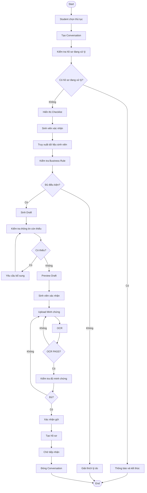
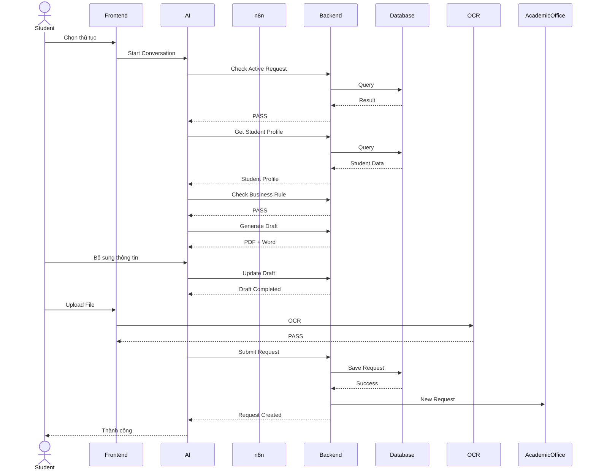
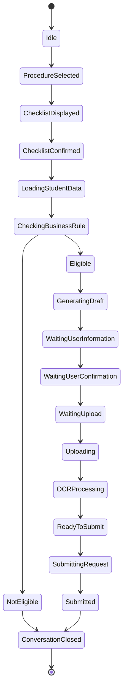

# Submit Procedure Workflow Specification

> Version: 1.0
>
> Workflow ID: WF-03.1
>
> Workflow Name: Submit Academic Procedure Request
>
> Related Use Case: UC 3.1 - Gửi yêu cầu thủ tục học vụ

---

# 1. Mục đích

Tài liệu này mô tả chi tiết quy trình gửi yêu cầu thực hiện thủ tục học vụ trong hệ thống Cổng Một Cửa.

Workflow này được thiết kế theo mô hình AI Agent + Workflow Automation (n8n), trong đó AI Agent đóng vai trò giao diện hội thoại với sinh viên, còn Backend Django chịu trách nhiệm xử lý nghiệp vụ và n8n điều phối toàn bộ quy trình.

Workflow này là tài liệu kỹ thuật (Technical Workflow Specification), được sử dụng làm cơ sở để phát triển:

- Front-end (Next.js)
- Backend (Django)
- AI Agent
- n8n Workflow
- Database
- API

---

# 2. Phạm vi áp dụng

Workflow này được sử dụng cho toàn bộ các thủ tục học vụ có quy trình xử lý thông qua AI Agent.

Hiện tại bao gồm:

- Chuyển ngành
- Bảo lưu
- Học tiếp
- Thôi học

Trong tương lai có thể mở rộng thêm các thủ tục khác mà không cần thay đổi kiến trúc.

---

# 3. Mục tiêu

Workflow phải đáp ứng các mục tiêu sau:

- Tự động kiểm tra điều kiện thực hiện thủ tục.
- Giảm số lần sinh viên phải đến trực tiếp Phòng Đào tạo.
- Tự động tạo mẫu đơn.
- Hướng dẫn sinh viên bổ sung thông tin còn thiếu.
- Kiểm tra sơ bộ minh chứng bằng OCR.
- Chuẩn hóa hồ sơ trước khi chuyển đến Phòng Đào tạo.
- Đảm bảo mọi quyết định nghiệp vụ được thực hiện bởi Backend.

---

# 4. Thành phần tham gia

| Thành phần | Vai trò |
|------------|----------|
| Sinh viên | Khởi tạo và hoàn thành hồ sơ |
| Next.js | Giao diện người dùng |
| AI Coordinator | Điều phối toàn bộ hội thoại |
| Conversation Agent | Quản lý ngữ cảnh |
| Procedure Agent | Quản lý quy trình thủ tục |
| Rule Agent | Thực hiện kiểm tra điều kiện thông qua Backend |
| OCR Agent | Kiểm tra sơ bộ minh chứng |
| n8n | Điều phối Workflow |
| Django Backend | Xử lý nghiệp vụ |
| PostgreSQL | Lưu trữ dữ liệu |
| Phòng Đào tạo | Tiếp nhận và xử lý hồ sơ thủ công |

---

# 5. Điều kiện tiên quyết

Workflow chỉ được phép bắt đầu khi đồng thời thỏa mãn các điều kiện sau:

- Sinh viên đã đăng nhập.
- Phiên đăng nhập còn hiệu lực.
- AI Agent hoạt động bình thường.
- n8n hoạt động bình thường.
- Backend có thể truy cập được.
- Database sẵn sàng.
- Thủ tục đã được cấu hình.
- Sinh viên không có hồ sơ đang xử lý.

Nếu bất kỳ điều kiện nào không thỏa mãn, Workflow không được phép khởi tạo.

---

# 6. Điều kiện kết thúc

Workflow kết thúc khi xảy ra một trong các trường hợp sau:

### Thành công

- Hồ sơ được tạo.
- Sinh mã hồ sơ.
- Chuyển trạng thái "Chờ tiếp nhận".
- Gửi tới Phòng Đào tạo.

### Thất bại

- Không đủ điều kiện.
- Người dùng hủy thủ tục.
- Backend lỗi.
- Người dùng đăng xuất.

---

# 7. Kiến trúc tổng quan

```text
                    Student
                       │
                       ▼
                Next.js Interface
                       │
                       ▼
                 AI Coordinator
                       │
      ┌────────────────┼────────────────┐
      │                │                │
      ▼                ▼                ▼
Conversation      Procedure       OCR Agent
Agent             Agent
      │                │
      └──────────┬─────┘
                 ▼
            Rule Agent
                 │
                 ▼
            Tool Calling
                 │
                 ▼
                 n8n
                 │
     ┌───────────┼────────────┐
     ▼           ▼            ▼
 Backend      OCR API     Notification
     │
     ▼
 PostgreSQL
```

---

# 8. Workflow Overview

Workflow bao gồm sáu giai đoạn chính.

## Phase 1

Khởi tạo Workflow

- Chọn thủ tục
- Khởi tạo Conversation

---

## Phase 2

Kiểm tra điều kiện

- Checklist
- Kiểm tra dữ liệu
- Đối chiếu Business Rule

---

## Phase 3

Tạo hồ sơ

- Sinh Draft
- Bổ sung thông tin
- Preview PDF
- Preview Word

---

## Phase 4

Thu thập minh chứng

- Upload
- OCR
- Kiểm tra đủ số lượng

---

## Phase 5

Gửi hồ sơ

- Sinh mã hồ sơ
- Lưu dữ liệu
- Chuyển Phòng Đào tạo

---

## Phase 6

Kết thúc

- Xóa Conversation
- Hoàn tất Workflow

---

# 9. Workflow Lifecycle

```text
START

↓

Select Procedure

↓

Conversation Created

↓

Business Rule Checking

↓

Generate Draft

↓

Complete Missing Information

↓

Preview Draft

↓

Upload Evidence

↓

OCR Checking

↓

Ready To Submit

↓

Submit Request

↓

Request Created

↓

Conversation Closed

↓

END
```

---

# 10. Conversation State Mapping

Workflow này sử dụng Conversation State được định nghĩa trong:

docs/architecture/conversation-state.md

Workflow không tự quản lý trạng thái hội thoại.

Mọi State đều phải được cập nhật thông qua Conversation State Manager.

---

# 11. Business Rule Mapping

Workflow này sử dụng toàn bộ Business Rule được định nghĩa tại:

docs/business-rules/system.md

Ngoài ra, mỗi thủ tục sẽ có Business Rule riêng.

Ví dụ:

- procedure-transfer-major.md
- procedure-study-leave.md
- procedure-resume-study.md
- procedure-withdraw.md

Workflow chỉ gọi Rule Engine.

Không tự kiểm tra điều kiện.

---

# 12. Technical Principles

Workflow tuân thủ các nguyên tắc sau:

## Backend First

Backend là nguồn dữ liệu duy nhất.

---

## AI Explain Only

AI chỉ giải thích kết quả.

Không quyết định kết quả.

---

## Human In The Loop

Phòng Đào tạo là đơn vị cuối cùng xác nhận hồ sơ.

---

## One Student - One Active Request

Một sinh viên chỉ được có một hồ sơ đang xử lý.

---

## One Conversation - One Procedure

Một Conversation chỉ thực hiện một thủ tục.

---

## Stateless Business Logic

Business Rule không lưu trong Prompt.

Luôn lấy từ Backend.

---

# Part 2. Workflow Detail (Step 1 → Step 6)

---

# STEP 1. Sinh viên chọn thủ tục

## Mục đích

Khởi tạo một Workflow mới cho thủ tục mà sinh viên muốn thực hiện.

Đây là điểm bắt đầu của toàn bộ quy trình.

---

## Actor

Sinh viên

---

## Input

- Sinh viên đã đăng nhập.
- Sidebar hiển thị danh sách các thủ tục.

Ví dụ:

- Chuyển ngành
- Bảo lưu
- Học tiếp
- Thôi học

---

## User Action

Sinh viên nhấn vào một thủ tục trên Sidebar.

Ví dụ:

```
Sidebar

> Chuyển ngành
```

---

## Front-end Action

Front-end gửi yêu cầu tới AI Coordinator.

```text
Procedure Selected

↓

Transfer Major
```

Đồng thời khóa việc chọn các thủ tục khác cho đến khi Workflow kết thúc.

---

## AI Action

AI Coordinator:

- Tạo Conversation mới.
- Xác định Procedure ID.
- Khởi tạo Conversation Context.
- Chuyển Conversation sang trạng thái:

```
Procedure Selected
```

---

## n8n Action

Chưa gọi Workflow.

---

## Backend Action

Kiểm tra:

- Thủ tục có tồn tại.
- Thủ tục còn hiệu lực.

---

## Database

Đọc:

Procedure

---

## Output

Conversation được khởi tạo.

---

## State Transition

```
Idle

↓

Procedure Selected
```

---

## Business Rules

- BR-SYS-005
- BR-SYS-010

---

## Error Handling

Nếu thủ tục không tồn tại.

↓

Thông báo:

```
Thủ tục hiện không khả dụng.
```

Workflow kết thúc.

---

# STEP 2. Kiểm tra hồ sơ đang xử lý

## Mục đích

Đảm bảo sinh viên không có nhiều hồ sơ đang xử lý đồng thời.

---

## Actor

Backend

---

## Input

Student ID

---

## AI Action

AI yêu cầu Backend kiểm tra hồ sơ.

---

## n8n Action

Gọi Tool:

```
CheckActiveProcedureRequest
```

---

## Backend Action

Kiểm tra các trạng thái:

- Chờ tiếp nhận
- Đang xử lý
- Chờ bổ sung

---

## Database

ProcedureRequest

---

## Decision

### Không có hồ sơ

↓

Tiếp tục Workflow.

### Có hồ sơ

↓

Dừng Workflow.

---

## AI Response

```
Bạn đang có một hồ sơ đang được xử lý.

Vui lòng hoàn thành hoặc hủy hồ sơ hiện tại trước khi tạo hồ sơ mới.
```

---

## State Transition

```
Procedure Selected

↓

Procedure Selected
```

(Không thay đổi State vì Workflow chưa bắt đầu.)

---

## Business Rules

BR-SYS-010

BR-SYS-011

---

# STEP 3. Hiển thị Checklist điều kiện

## Mục đích

Cho phép sinh viên tự đánh giá sơ bộ điều kiện trước khi hệ thống kiểm tra.

Checklist chỉ mang tính chất xác nhận ban đầu.

Không được sử dụng làm căn cứ quyết định.

---

## Actor

AI Agent

---

## Input

Procedure ID

---

## Backend Action

Đọc danh sách Checklist của thủ tục.

---

## Database

ProcedureChecklist

---

## AI Action

Hiển thị:

- Lời chào.
- Giới thiệu AI.
- Danh sách điều kiện.

Ví dụ:

```
Xin chào!

Tôi là AI Agent hỗ trợ thủ tục Chuyển ngành.

Trước khi bắt đầu,
hãy xác nhận các điều kiện sau.
```

```
☐ Không phải sinh viên năm cuối.

☐ Không thuộc diện buộc thôi học.

☐ Còn thời gian học tập.

☐ ...
```

---

## User Action

Sinh viên tích các điều kiện.

---

## Output

Checklist Completed.

---

## State Transition

```
Procedure Selected

↓

Checklist Displayed
```

---

## Business Rules

Procedure Business Rule

---

## Technical Rules

Checklist không thay thế việc kiểm tra Business Rule.

---

# STEP 4. Sinh viên xác nhận bắt đầu

## Mục đích

Xác nhận sinh viên muốn AI thực hiện quy trình.

---

## Actor

Sinh viên

---

## Input

Checklist Completed

---

## User Action

Ví dụ:

```
Tôi muốn bắt đầu thủ tục.
```

Hoặc

```
Bắt đầu.
```

Hoặc

```
Tiếp tục.
```

---

## AI Action

AI nhận diện Intent:

```
START_PROCEDURE
```

---

## Output

Workflow bắt đầu.

---

## State Transition

```
Checklist Displayed

↓

Checklist Confirmed
```

---

## AI Response

```
Tôi sẽ bắt đầu kiểm tra dữ liệu học tập của bạn.

Quá trình này có thể mất vài giây.
```

---

# STEP 5. Truy xuất dữ liệu sinh viên

## Mục đích

Lấy toàn bộ dữ liệu cần thiết để kiểm tra điều kiện.

---

## Actor

Rule Agent

---

## Tool

```
GetStudentProfile
```

---

## n8n Action

Workflow:

```
Get Student

↓

Backend

↓

Return Profile
```

---

## Backend Action

Lấy:

- Hồ sơ sinh viên.
- GPA.
- Tín chỉ.
- Trạng thái học tập.
- Kỷ luật.
- Thời gian học.
- Các dữ liệu khác phục vụ kiểm tra.

---

## Database

Student

AcademicRecord

Discipline

Enrollment

---

## AI Response

```
Tôi đang truy xuất dữ liệu học tập của bạn từ hệ thống.
```

---

## Output

Student Profile Loaded.

---

## State Transition

```
Checklist Confirmed

↓

Loading Student Data
```

---

## Error Handling

Nếu Backend lỗi.

↓

Thông báo:

```
Không thể truy xuất dữ liệu sinh viên.

Vui lòng thử lại sau.
```

Workflow kết thúc.

---

# STEP 6. Kiểm tra Business Rule

## Mục đích

Đánh giá sinh viên có đủ điều kiện thực hiện thủ tục hay không.

Đây là bước quan trọng nhất của toàn bộ Workflow.

---

## Actor

Rule Agent

---

## Input

- Student Profile
- Procedure ID

---

## Tool

```
CheckBusinessRule
```

---

## n8n Action

```
Profile

↓

Rule Engine

↓

Backend

↓

Result
```

---

## Backend Action

Thực hiện:

- Đối chiếu dữ liệu.
- Kiểm tra từng điều kiện.
- Trả kết quả.

Ví dụ:

| Điều kiện | Kết quả |
|-----------|---------|
| GPA | PASS |
| Năm học | PASS |
| Kỷ luật | FAIL |

---

## AI Action

AI không tự đánh giá.

AI chỉ diễn giải kết quả.

Ví dụ:

```
Tôi đã hoàn tất việc kiểm tra.

Kết quả:

✓ GPA đạt yêu cầu.

✓ Không thuộc diện buộc thôi học.

✗ Bạn hiện đang là sinh viên năm cuối.

Do đó bạn chưa đủ điều kiện thực hiện thủ tục Chuyển ngành.
```

---

## Decision

### PASS

↓

Chuyển sang bước sinh Draft.

---

### FAIL

↓

Giải thích nguyên nhân.

↓

Kết thúc Conversation.

---

## State Transition

```
Loading Student Data

↓

Checking Business Rules
```

↓

PASS

```
Eligible
```

↓

FAIL

```
Not Eligible
```

---

## Business Rules

- BR-SYS-002
- BR-SYS-003
- BR-SYS-004

---

## Technical Rules

AI không được tự suy luận Business Rule.

Backend là nguồn quyết định duy nhất.

---

## Error Handling

Nếu Rule Engine lỗi.

↓

Thông báo:

```
Không thể kiểm tra điều kiện.

Vui lòng thử lại sau.
```

Workflow kết thúc.


# Part 3. Workflow Detail (Step 7 → Step 12)

---

# STEP 7. Tạo mẫu đơn thủ tục (Draft Generation)

## Mục đích

Sau khi sinh viên đáp ứng đầy đủ Business Rule, hệ thống bắt đầu tạo mẫu đơn thủ tục (Draft Form).

Draft Form là bản nháp của hồ sơ sẽ được gửi đến Phòng Đào tạo sau khi sinh viên xác nhận.

Draft chỉ được tạo khi tất cả điều kiện đều đạt.

---

## Actor

- AI Coordinator
- Procedure Agent
- Django Backend

---

## Input

- Procedure ID
- Student Profile
- Business Rule Result = PASS

---

## Trigger

Business Rule được kiểm tra thành công.

---

## AI Action

AI thông báo:

```text
Bạn đã đủ điều kiện thực hiện thủ tục.

Tôi đang tạo mẫu đơn dựa trên dữ liệu của bạn.

Vui lòng chờ trong giây lát...
```

---

## n8n Action

Workflow

```text
Generate Draft

↓

Call Backend

↓

Generate PDF

↓

Generate Word

↓

Return Draft
```

---

## Backend Action

Backend thực hiện:

- Đọc mẫu đơn chuẩn của thủ tục.
- Điền các dữ liệu có sẵn của sinh viên.
- Sinh bản Word.
- Sinh bản PDF Preview.
- Phân tích các trường còn thiếu.

---

## Database

Đọc

- Student
- Procedure Template

Không lưu Draft ở bước này.

---

## Output

Draft Form

Bao gồm:

- PDF Preview
- Word Preview
- Missing Fields

---

## State Transition

```text
Eligible

↓

Generating Draft
```

---

## Business Rules

- BR-SYS-012
- BR-SYS-014
- BR-SYS-015

---

## Technical Rules

Draft chỉ được sinh bởi Backend.

AI Agent không được phép tạo hoặc chỉnh sửa Draft.

---

# STEP 8. Kiểm tra thông tin còn thiếu

## Mục đích

Xác định các trường thông tin mà hệ thống không thể tự động điền.

Các trường này phải được sinh viên bổ sung trước khi tiếp tục.

---

## Actor

Backend

---

## Input

Draft Form

---

## Backend Action

Kiểm tra từng trường dữ liệu.

Ví dụ

```text
✓ Họ tên

✓ MSSV

✓ Ngành học

✓ Khóa học

✗ Lý do chuyển ngành

✗ Nguyện vọng

✗ Số điện thoại liên hệ
```

---

## Output

Missing Field List

---

## State Transition

```text
Generating Draft

↓

Waiting User Information
```

---

## Technical Rules

Danh sách Missing Field phải được Backend trả về.

AI không tự xác định.

---

# STEP 9. AI yêu cầu bổ sung thông tin

## Mục đích

Thu thập đầy đủ các trường còn thiếu để hoàn thiện Draft.

---

## Actor

Conversation Agent

---

## Input

Missing Field List

---

## AI Response

Ví dụ

```text
Mẫu đơn của bạn còn thiếu một số thông tin.

Vui lòng bổ sung các nội dung sau:

• Lý do chuyển ngành

• Nguyện vọng sau khi chuyển

• Số điện thoại liên hệ

Bạn có thể trả lời trong một tin nhắn hoặc nhiều tin nhắn.
```

---

## User Action

Sinh viên nhập thông tin.

Ví dụ

```text
Lý do chuyển ngành:

...

Nguyện vọng:

...

SĐT:

...
```

---

## AI Action

Conversation Agent lưu tạm dữ liệu.

Sau đó gửi Backend kiểm tra.

---

## Backend Action

Xác nhận:

- đủ dữ liệu
- còn thiếu dữ liệu

---

## Decision

### Đủ

↓

STEP 10

---

### Chưa đủ

↓

AI tiếp tục hỏi toàn bộ các trường còn thiếu.

Ví dụ

```text
Bạn vẫn còn thiếu:

• Số điện thoại

• Nguyện vọng
```

---

## State Transition

```text
Waiting User Information

↓

Waiting User Information
```

(Lặp đến khi hoàn tất.)

---

## Business Rules

BR-SYS-016

---

# STEP 10. Hoàn thiện Draft

## Mục đích

Cập nhật Draft bằng dữ liệu sinh viên vừa bổ sung.

---

## Actor

Backend

---

## Input

Missing Field Value

---

## Backend Action

Điền toàn bộ dữ liệu vào Draft.

Sinh lại:

- PDF

- Word

---

## Database

Không lưu Draft.

Chỉ tạo bản Preview.

---

## Output

Completed Draft

---

## State Transition

```text
Waiting User Information

↓

Waiting User Confirmation
```

---

## Technical Rules

Backend chỉ giữ bản Draft cuối.

Không lưu lịch sử Draft.

---

## Business Rules

BR-SYS-017

---

# STEP 11. Hiển thị Preview cho sinh viên

## Mục đích

Cho phép sinh viên xem toàn bộ hồ sơ trước khi xác nhận.

---

## Actor

Front-end

---

## Input

Completed Draft

---

## Front-end

Hiển thị

```text
PDF Preview

Word Preview
```

Ngoài ra còn hiển thị

```text
✓ Thông tin cá nhân

✓ Thông tin thủ tục

✓ Nội dung đã bổ sung
```

---

## AI Response

Ví dụ

```text
Tôi đã hoàn thiện mẫu đơn.

Bạn vui lòng kiểm tra lại toàn bộ thông tin.

Nếu cần chỉnh sửa, hãy cho tôi biết.

Nếu thông tin chính xác, vui lòng xác nhận để chuyển sang bước tải minh chứng.
```

---

## Decision

### Đồng ý

↓

STEP 12

---

### Chỉnh sửa

↓

Quay lại STEP 9

---

## State Transition

```text
Waiting User Confirmation

↓

Waiting Upload
```

---

# STEP 12. Chuẩn bị Upload minh chứng

## Mục đích

Xác định các minh chứng mà sinh viên phải nộp.

---

## Actor

Procedure Agent

---

## Input

Procedure ID

---

## Backend Action

Đọc danh sách minh chứng.

Ví dụ

```text
Chuyển ngành

↓

1.

Đơn xin chuyển ngành

2.

Bảng điểm

3.

...

```

---

## AI Response

Ví dụ

```text
Bạn đã hoàn thành mẫu đơn.

Tiếp theo, vui lòng tải lên các minh chứng sau.

1. Bảng điểm.

2. Minh chứng ...

Bạn có thể nhấn vào biểu tượng tải tệp bên trái khung chat để tải từng minh chứng.
```

---

## Front-end

Hiển thị

- Upload Button

- Drag & Drop

- Danh sách file cần nộp

- Trạng thái từng file

Ví dụ

```text
□ Bảng điểm

□ Đơn xin chuyển ngành

□ ...
```

---

## State Transition

```text
Waiting User Confirmation

↓

Waiting Upload
```

---

## Business Rules

- BR-SYS-018

- BR-SYS-019

---

## Technical Rules

Danh sách minh chứng được Backend trả về.

Không hard-code trên Front-end.

# Part 4. Workflow Detail (Step 13 → Step 18)

---

# STEP 13. Sinh viên tải minh chứng

## Mục đích

Thu thập đầy đủ các minh chứng theo yêu cầu của từng thủ tục trước khi gửi hồ sơ.

Minh chứng là thành phần bắt buộc đối với các thủ tục có yêu cầu tài liệu bổ sung.

---

## Actor

Sinh viên

---

## Input

Danh sách minh chứng được Backend trả về.

Ví dụ:

- Bảng điểm
- Quyết định liên quan
- Giấy xác nhận
- ...

---

## User Action

Sinh viên nhấn biểu tượng tải tệp bên trái khung chat.

Sau đó lựa chọn file từ thiết bị.

Có thể tải:

- PDF
- JPG
- JPEG
- PNG

---

## Front-end Action

Front-end thực hiện:

- Upload từng file.
- Hiển thị tiến trình Upload.
- Preview tên file.
- Preview trạng thái.

Ví dụ

```text
✓ BangDiem.pdf

Uploading...

Completed
```

---

## AI Action

AI thông báo

```text
Tôi đã nhận được minh chứng của bạn.

Đang tiến hành kiểm tra...
```

---

## Backend Action

Lưu file tạm thời.

Chưa tạo hồ sơ chính thức.

---

## Database

Conversation Upload

---

## Output

Uploaded Files

---

## State Transition

```text
Waiting Upload

↓

Uploading
```

---

## Business Rules

BR-SYS-018

BR-SYS-019

---

## Technical Rules

Front-end chỉ upload.

Không kiểm tra nội dung.

---

# STEP 14. OCR kiểm tra minh chứng

## Mục đích

Kiểm tra sơ bộ minh chứng trước khi cho phép gửi hồ sơ.

OCR không xác minh nội dung giấy tờ.

OCR chỉ xác minh tính đầy đủ và khả năng đọc của file.

---

## Actor

OCR Agent

---

## Input

Uploaded Files

---

## n8n Action

Workflow

```text
Uploaded File

↓

OCR Service

↓

Result
```

---

## OCR Action

Kiểm tra

- Đúng loại file

- Đúng cấu trúc tên file

- Có thể đọc văn bản

---

## Không kiểm tra

OCR KHÔNG kiểm tra:

- Nội dung đúng hay sai

- Minh chứng hợp lệ

- Có giả mạo hay không

- Có đúng người hay không

Các nội dung trên do Phòng Đào tạo xử lý.

---

## Output

Ví dụ

```text
✓ File hợp lệ

✓ OCR thành công

✓ Đọc được văn bản
```

---

## State Transition

```text
Uploading

↓

OCR Processing
```

---

## Error Handling

Ví dụ

```text
✗ Sai định dạng

↓

Upload lại
```

---

```text
✗ Không đọc được

↓

Upload lại
```

---

## Business Rules

BR-SYS-022

BR-SYS-023

BR-SYS-024

---

# STEP 15. Kiểm tra tính đầy đủ hồ sơ

## Mục đích

Đảm bảo toàn bộ minh chứng bắt buộc đã được tải lên.

---

## Actor

Procedure Agent

---

## Backend Action

Đối chiếu

Danh sách yêu cầu

↓

Danh sách Upload

---

## Decision

### Đầy đủ

↓

Ready To Submit

---

### Thiếu

↓

Yêu cầu Upload tiếp.

---

## AI Response

Ví dụ

```text
Bạn còn thiếu các minh chứng sau:

• Bảng điểm

• Giấy xác nhận

Vui lòng tải lên trước khi gửi hồ sơ.
```

---

## Output

Upload Checklist

---

## State Transition

```text
OCR Processing

↓

Ready To Submit
```

---

## Technical Rules

OCR PASS

≠

Đầy đủ minh chứng.

Hai bước này độc lập.

---

# STEP 16. Sinh viên xác nhận gửi hồ sơ

## Mục đích

Đây là bước xác nhận cuối cùng của sinh viên trước khi hồ sơ được tạo chính thức.

Sau bước này sinh viên không thể chỉnh sửa hồ sơ.

---

## Actor

Sinh viên

---

## AI Response

Ví dụ

```text
Bạn đã hoàn tất hồ sơ.

Nếu đồng ý gửi hồ sơ tới Phòng Đào tạo, vui lòng nhập:

"Gửi hồ sơ"

hoặc

"Xác nhận gửi"

hoặc

"Đồng ý"
```

---

## Intent

AI nhận diện

```text
SUBMIT_REQUEST
```

---

## Decision

### Đồng ý

↓

STEP 17

---

### Chưa đồng ý

↓

Tiếp tục Waiting.

---

## State Transition

```text
Ready To Submit

↓

Submitting Request
```

---

## Business Rules

BR-SYS-025

---

# STEP 17. Tạo hồ sơ chính thức

## Mục đích

Tạo hồ sơ chính thức và chuyển đến Phòng Đào tạo.

Đây là bước duy nhất ghi dữ liệu vào hệ thống.

---

## Actor

Backend

---

## Tool

```text
CreateProcedureRequest
```

---

## n8n Action

Workflow

```text
Generate Request

↓

Save Request

↓

Save Files

↓

Save PDF

↓

Save Word

↓

Notify Academic Office
```

---

## Backend Action

Backend thực hiện

- Sinh Request ID

- Sinh Request Code

- Lưu Draft thành hồ sơ

- Lưu PDF

- Lưu Word

- Lưu Minh chứng

- Ghi lịch sử

- Đổi trạng thái

↓

Chờ tiếp nhận

---

## Database

Insert

- Procedure Request

- Request File

- Request History

---

## Output

Request Created

---

## AI Response

Ví dụ

```text
Hồ sơ của bạn đã được tạo thành công.

Mã hồ sơ:

HS-2026-000123

Trạng thái:

Chờ tiếp nhận.
```

---

## State Transition

```text
Submitting Request

↓

Submitted
```

---

## Business Rules

BR-SYS-012

---

# STEP 18. Kết thúc Workflow

## Mục đích

Hoàn tất Workflow và đóng Conversation.

---

## Actor

Conversation Agent

---

## AI Action

AI gửi thông báo cuối.

Ví dụ

```text
Cảm ơn bạn.

Hồ sơ đã được gửi tới Phòng Đào tạo.

Bạn có thể theo dõi trạng thái tại mục:

"Hồ sơ đã gửi".
```

---

## Backend Action

Đánh dấu

Conversation Completed

---

## Conversation Action

Xóa

- Chat History

- Temporary Context

- Draft

- Upload Session

Giữ lại

- Hồ sơ

- Minh chứng

- PDF

- Word

- Nhật ký xử lý

---

## State Transition

```text
Submitted

↓

Conversation Closed

↓

END
```

---

## Business Rules

BR-SYS-008

BR-SYS-009

---

## Technical Rules

Conversation chỉ bị xóa sau khi Backend xác nhận hồ sơ đã được lưu thành công.

Không được xóa Conversation trước khi giao dịch hoàn tất.

---

# Kết quả cuối cùng của Workflow

Sau khi hoàn thành Workflow, hệ thống phải đảm bảo:

✓ Hồ sơ được tạo thành công.

✓ Sinh mã hồ sơ duy nhất.

✓ Toàn bộ minh chứng được lưu.

✓ PDF được lưu.

✓ Word được lưu.

✓ Lịch sử xử lý được lưu.

✓ Trạng thái hồ sơ là "Chờ tiếp nhận".

✓ Conversation được đóng.

✓ Dữ liệu tạm thời được xóa.

✓ Sinh viên có thể theo dõi hồ sơ tại chức năng "Hồ sơ đã gửi".

# Part 5. Workflow Modeling

---

# 1. Workflow Activity Diagram

Activity Diagram mô tả toàn bộ quy trình gửi yêu cầu thủ tục học vụ từ khi sinh viên lựa chọn thủ tục đến khi hồ sơ được chuyển sang Phòng Đào tạo.



---

# 2. Workflow Sequence Diagram

Sequence Diagram mô tả tương tác giữa các thành phần trong hệ thống.



---

# 3. Conversation State Diagram

Workflow sử dụng Conversation State được định nghĩa trong:

docs/architecture/conversation-state.md

Dưới đây là sơ đồ chuyển trạng thái.



---

# 4. Decision Tree

## 4.1 Business Rule

```text
Check Business Rule

        │

        ▼

 PASS ?

   │

 ┌─┴──────────┐

 │             │

YES            NO

 │             │

 ▼             ▼

Generate    Explain

Draft       Reason

 │             │

 ▼             ▼

Continue     End
```

---

## 4.2 OCR

```text
OCR

 │

 ▼

PASS ?

 │

┌──────────────┐

│              │

YES            NO

│              │

▼              ▼

Check        Upload

Enough       Again
```

---

## 4.3 Upload

```text
Enough Files ?

 │

 ▼

┌─────────────┐

│             │

YES           NO

│             │

▼             ▼

Submit     Waiting

Request    Upload
```

---

# 5. Data Flow

```text
Student

│

▼

Next.js

│

▼

AI Coordinator

│

▼

Conversation Agent

│

▼

Procedure Agent

│

▼

Rule Agent

│

▼

n8n

│

▼

Django Backend

│

▼

Database

│

▼

Result

│

▼

AI

│

▼

Student
```

---

# 6. Workflow Phase Mapping

| Phase | Mô tả |
|---------|---------------------------|
| Phase 1 | Khởi tạo Conversation |
| Phase 2 | Kiểm tra Business Rule |
| Phase 3 | Sinh Draft |
| Phase 4 | Bổ sung thông tin |
| Phase 5 | Upload Minh chứng |
| Phase 6 | OCR |
| Phase 7 | Submit Request |
| Phase 8 | Close Conversation |

---

# 7. Responsibility Matrix

| Thành phần | Trách nhiệm |
|------------|-------------|
| Student | Thực hiện thao tác |
| Front-end | Hiển thị UI |
| AI Coordinator | Điều phối hội thoại |
| Conversation Agent | Quản lý Context |
| Procedure Agent | Quản lý Workflow |
| Rule Agent | Kiểm tra Business Rule |
| OCR Agent | Kiểm tra minh chứng |
| n8n | Điều phối Tool |
| Backend | Thực hiện nghiệp vụ |
| Database | Lưu dữ liệu |
| Phòng Đào tạo | Xử lý hồ sơ |

---

# 8. Workflow Summary

Workflow này gồm:

- 18 bước xử lý nghiệp vụ.
- 8 giai đoạn chính.
- 4 AI Agent chuyên trách.
- 1 Workflow Automation (n8n).
- 1 Backend xử lý nghiệp vụ.
- 1 OCR Agent kiểm tra sơ bộ minh chứng.

Trong toàn bộ quy trình:

- AI Agent **không quyết định nghiệp vụ**, chỉ điều phối hội thoại và giải thích kết quả.
- Backend Django là thành phần duy nhất thực thi Business Rule và sinh hồ sơ.
- n8n chịu trách nhiệm điều phối các bước giữa AI Agent, Backend và OCR.
- Phòng Đào tạo vẫn là đơn vị ra quyết định cuối cùng đối với hồ sơ sau khi tiếp nhận.

Workflow tuân thủ nguyên tắc:

- Backend First.
- AI Explain Only.
- Human In The Loop.
- One Student – One Active Request.
- One Conversation – One Procedure.

# Part 6. System Mapping Specification

---

# 1. Business Rule Mapping

Workflow không chứa Business Rule.

Workflow chỉ gọi Rule Engine để kiểm tra.

Business Rule được định nghĩa tại:

```
docs/business-rules/system.md
```

và

```
docs/business-rules/procedures/
```

Ví dụ:

```
transfer-major.md

study-leave.md

resume-study.md

withdraw-study.md
```

---

## Mapping

| Workflow Step | Rule Engine | Backend |
|---------------|------------|----------|
| STEP 2 | Kiểm tra hồ sơ đang xử lý | ✓ |
| STEP 5 | Lấy dữ liệu sinh viên | ✓ |
| STEP 6 | Kiểm tra điều kiện | ✓ |
| STEP 8 | Kiểm tra dữ liệu còn thiếu | ✓ |
| STEP 10 | Sinh Draft | ✓ |
| STEP 12 | Lấy danh sách minh chứng | ✓ |
| STEP 14 | OCR Validation | ✓ |
| STEP 15 | Kiểm tra đủ minh chứng | ✓ |
| STEP 17 | Tạo hồ sơ | ✓ |

---

# 2. AI Agent Mapping

Workflow sử dụng kiến trúc Multi-Agent.

AI Agent không trực tiếp xử lý nghiệp vụ.

---

## AI Coordinator

### Trách nhiệm

- Điều phối Agent
- Quản lý Conversation
- Routing

Được sử dụng tại

| Step |
|------|
| 1 |
| 3 |
| 4 |
| 7 |
| 9 |
| 11 |
| 12 |
| 16 |
| 18 |

---

## Conversation Agent

### Trách nhiệm

- Quản lý Context

- Intent Detection

- Memory

Được sử dụng tại

| Step |
|------|
| 1 |
| 4 |
| 9 |
| 11 |
| 16 |
| 18 |

---

## Rule Agent

### Trách nhiệm

- Gọi Backend

- Giải thích Business Rule

Không tự đánh giá.

Được sử dụng tại

| Step |
|------|
| 5 |
| 6 |

---

## OCR Agent

### Trách nhiệm

- OCR

- File Validation

Được sử dụng tại

| Step |
|------|
| 13 |
| 14 |
| 15 |

---

# 3. Conversation Context Mapping

Conversation Context được định nghĩa tại

```
docs/architecture/conversation-state.md
```

---

## Context Structure

```text
Conversation

├── Student

├── Procedure

├── Current State

├── Draft

├── Missing Fields

├── Uploaded Files

├── OCR Result

├── Rule Result

└── Intent
```

---

## Context Update

| Step | Update |
|-------|---------|
| 1 | Procedure |
| 4 | Intent |
| 5 | Student Profile |
| 6 | Rule Result |
| 8 | Missing Field |
| 9 | User Input |
| 10 | Draft |
| 13 | Upload |
| 14 | OCR |
| 16 | Submit Intent |

---

# 4. API Mapping

Workflow chỉ giao tiếp với Backend thông qua API.

Không truy cập Database trực tiếp.

---

## Authentication

| API | Mục đích |
|------|----------|
| Login | Đăng nhập |
| Logout | Đăng xuất |
| Refresh Token | Gia hạn phiên |

---

## Student

| API | Mục đích |
|------|----------|
| Get Student Profile | Lấy hồ sơ |
| Get Academic Record | Lấy kết quả học tập |

---

## Procedure

| API | Mục đích |
|------|----------|
| Get Procedure | Lấy thông tin thủ tục |
| Get Checklist | Lấy checklist |
| Check Rule | Kiểm tra điều kiện |
| Generate Draft | Sinh mẫu đơn |
| Get Required Documents | Danh sách minh chứng |
| Submit Request | Gửi hồ sơ |

---

## Upload

| API | Mục đích |
|------|----------|
| Upload File | Upload |
| Delete Upload | Xóa Upload |

---

## OCR

| API | Mục đích |
|------|----------|
| OCR Validation | Kiểm tra OCR |

---

# 5. Database Mapping

Workflow chỉ thao tác với các bảng sau.

| Table | Step |
|--------|------|
| Student | 5 |
| Academic Record | 5 |
| Procedure | 1 |
| Procedure Checklist | 3 |
| Procedure Template | 7 |
| Conversation | 1-18 |
| Conversation Message | 1-18 |
| Upload Session | 13 |
| OCR Result | 14 |
| Procedure Request | 17 |
| Procedure Request File | 17 |
| Request History | 17 |

---

# 6. n8n Workflow Mapping

n8n chịu trách nhiệm điều phối.

---

## Workflow 01

```
Check Student
```

STEP

```
5
```

---

## Workflow 02

```
Check Rule
```

STEP

```
6
```

---

## Workflow 03

```
Generate Draft
```

STEP

```
7
```

---

## Workflow 04

```
Update Draft
```

STEP

```
10
```

---

## Workflow 05

```
OCR Validation
```

STEP

```
14
```

---

## Workflow 06

```
Submit Procedure
```

STEP

```
17
```

---

# 7. Event Mapping

Workflow phát sinh các Event sau.

| Event | Trigger |
|--------|----------|
| Conversation Started | STEP 1 |
| Checklist Completed | STEP 4 |
| Rule Passed | STEP 6 |
| Draft Generated | STEP 7 |
| Draft Updated | STEP 10 |
| Upload Completed | STEP 13 |
| OCR Passed | STEP 14 |
| Ready To Submit | STEP 15 |
| Request Submitted | STEP 17 |
| Conversation Closed | STEP 18 |

---

# 8. Logging Mapping

Mỗi Event đều phải được ghi log.

Ví dụ

```
Timestamp

Student

Procedure

Conversation ID

Current State

Result

Duration
```

---

# 9. Notification Mapping

Workflow phát sinh Notification.

Ví dụ

| Event | Notification |
|--------|--------------|
| Rule Failed | Thông báo |
| Draft Ready | Thông báo |
| Upload Required | Thông báo |
| Submit Success | Thông báo |
| Backend Error | Thông báo |

---

# 10. Security Mapping

Workflow tuân thủ các nguyên tắc.

- JWT Authentication

- RBAC

- HTTPS

- File Validation

- Conversation Isolation

- Session Validation

- Audit Logging

- File Virus Scan (Future)

---

# 11. Future Extension

Workflow được thiết kế để có thể mở rộng.

Ví dụ

- Thêm thủ tục mới.

- Thay OCR Engine.

- Thay AI Model.

- Thay Rule Engine.

- Thay Workflow Engine.

Không cần thay đổi Front-end.

---

# 12. Summary

Workflow này sử dụng:

- Multi-Agent AI Architecture.
- Conversation State Machine.
- Backend Rule Engine.
- Workflow Automation (n8n).
- OCR Validation.
- Preview PDF/Word.
- Event-driven Processing.
- Context-aware Conversation.

Mỗi thành phần có trách nhiệm riêng và giao tiếp thông qua API hoặc Workflow Engine, giúp giảm phụ thuộc giữa các lớp và hỗ trợ mở rộng hệ thống trong tương lai.

# Part 7. Implementation Specification

---

# 1. Front-end Implementation

## Mục tiêu

Front-end chịu trách nhiệm:

- Hiển thị giao diện.
- Quản lý trạng thái giao diện.
- Gửi hành động của người dùng.
- Hiển thị phản hồi của AI.
- Upload minh chứng.
- Preview hồ sơ.

Front-end **không xử lý Business Rule**.

---

## Technology

- Next.js
- TypeScript
- Tailwind CSS
- React Query
- Zustand (Conversation State)
- Axios

---

## UI Components

Workflow sử dụng các Component sau.

| Component | Chức năng |
|------------|-----------|
| Procedure Sidebar | Danh sách thủ tục |
| Chat Window | Hội thoại AI |
| Chat Input | Nhập tin nhắn |
| Upload Button | Upload minh chứng |
| File List | Danh sách file |
| Draft Preview | Preview PDF/Word |
| Missing Field Form | Bổ sung thông tin |
| Confirmation Dialog | Xác nhận gửi |
| Loading Indicator | Trạng thái xử lý |

---

## Front-end State

```text
ConversationState

↓

Current Procedure

↓

Messages

↓

Draft

↓

Missing Fields

↓

Uploads

↓

Current Step
```

---

## Front-end Responsibilities

- Không kiểm tra điều kiện.
- Không sinh mẫu đơn.
- Không OCR.
- Không lưu hồ sơ.
- Không quyết định nghiệp vụ.

---

# 2. Backend Implementation

## Technology

- Django
- Django REST Framework
- PostgreSQL

---

## Backend Layer

```text
API

↓

View

↓

Serializer

↓

Service

↓

Rule Engine

↓

Repository

↓

Database
```

---

## Backend Responsibilities

Backend chịu trách nhiệm:

- Authentication.
- Business Rule.
- Sinh Draft.
- Sinh PDF.
- Sinh Word.
- OCR Integration.
- Upload.
- Lưu hồ sơ.
- Ghi lịch sử.
- Audit Log.

---

## Không thực hiện

Backend không:

- Quản lý hội thoại AI.
- Hiển thị giao diện.

---

# 3. AI Agent Implementation

Workflow sử dụng mô hình Multi-Agent.

---

## AI Coordinator

Điều phối toàn bộ Agent.

---

## Conversation Agent

- Intent Detection
- Conversation Context
- Session Memory

---

## Rule Agent

- Gọi Backend.
- Giải thích Business Rule.

Không quyết định Business Rule.

---

## OCR Agent

- OCR.
- File Validation.
- Upload Validation.

---

# 4. n8n Workflow Implementation

n8n là Workflow Orchestrator.

Không chứa Business Rule.

---

Workflow

```text
Receive Event

↓

Call Backend

↓

Call OCR

↓

Update Conversation

↓

Return Result
```

---

## Retry Policy

| Service | Retry |
|----------|--------|
| Backend API | 3 |
| OCR | 3 |
| AI | 1 |
| Database | 0 |

---

# 5. Conversation Lifecycle

```text
Conversation Created

↓

Running

↓

Waiting

↓

Submitting

↓

Completed

↓

Deleted
```

Conversation chỉ tồn tại trong một phiên xử lý thủ tục.

---

# 6. File Lifecycle

```text
Upload

↓

Temporary Storage

↓

OCR

↓

Waiting Submit

↓

Save Request

↓

Permanent Storage
```

Nếu Workflow bị hủy.

↓

Toàn bộ Upload Session bị xóa.

---

# 7. Draft Lifecycle

```text
Generate Draft

↓

Missing Information

↓

Update Draft

↓

Preview

↓

Submit

↓

Archive
```

Chỉ lưu phiên bản cuối cùng.

---

# 8. Request Lifecycle

```text
Draft

↓

Submitted

↓

Waiting Reception

↓

Processing

↓

Completed

↓

Closed
```

---

# 9. Error Recovery

## Backend Error

```text
Retry

↓

Fail

↓

Notify Student

↓

End Workflow
```

---

## OCR Error

```text
Retry

↓

Fail

↓

Upload Again
```

---

## Upload Error

```text
Retry

↓

Upload Again
```

---

## AI Error

```text
Reload Conversation

↓

Continue Workflow
```

---

# 10. Timeout Policy

| Hoạt động | Timeout |
|-----------|----------|
| Backend API | 30s |
| OCR | 60s |
| AI Response | 30s |
| Upload | 120s |

Sau Timeout.

↓

Retry.

↓

Nếu tiếp tục thất bại.

↓

Kết thúc Workflow.

---

# 11. Audit Log

Mỗi bước đều phải ghi log.

Ví dụ

```text
Timestamp

Conversation ID

Student ID

Procedure

Current State

Action

Result

Duration

Operator
```

---

# 12. Performance Target

| Chức năng | Mục tiêu |
|------------|----------|
| Check Rule | <3s |
| Generate Draft | <5s |
| OCR | <10s |
| Upload | <30s |
| Submit | <5s |

---

# 13. Security

Workflow phải đảm bảo:

- JWT Authentication.
- HTTPS.
- RBAC.
- Conversation Isolation.
- Temporary File Encryption.
- Audit Logging.
- Input Validation.
- File Validation.
- XSS Protection.
- CSRF Protection.
- SQL Injection Protection.

---

# 14. Scalability

Kiến trúc phải cho phép:

- Thêm AI Model.
- Thêm Procedure.
- Thêm OCR Engine.
- Thêm Workflow.
- Thêm Agent.
- Thêm Notification Service.

Không cần sửa Front-end.

---

# 15. Deployment Recommendation

## Front-end

- Vercel

hoặc

- Docker + Nginx

---

## Backend

- Docker

- Gunicorn

- Nginx

---

## Database

PostgreSQL

---

## AI

OpenAI API

hoặc

Mô hình RAG nội bộ.

---

## Workflow

n8n

---

## Storage

MinIO

hoặc

AWS S3

---

# 16. Coding Principles

Toàn bộ Workflow phải tuân thủ:

- SOLID.
- Clean Architecture.
- Repository Pattern.
- Service Layer Pattern.
- Dependency Injection.
- RESTful API.
- Stateless Service.
- Event-driven Workflow.

---

# 17. Summary

Workflow được triển khai theo kiến trúc phân tầng:

```text
Next.js UI

↓

AI Coordinator

↓

n8n Workflow

↓

Django Backend

↓

PostgreSQL
```

Mỗi thành phần chỉ chịu trách nhiệm cho đúng phạm vi của mình:

- Front-end hiển thị giao diện.
- AI quản lý hội thoại và điều phối.
- n8n điều phối các quy trình.
- Django xử lý nghiệp vụ.
- PostgreSQL lưu trữ dữ liệu.

Việc tách biệt trách nhiệm giúp hệ thống dễ bảo trì, dễ mở rộng và giảm sự phụ thuộc giữa các thành phần.

# Part 8. Development Guidelines & Future Roadmap

---

# 1. Mục tiêu

Tài liệu này định nghĩa các nguyên tắc phát triển, tiêu chuẩn triển khai và định hướng mở rộng Workflow "Gửi yêu cầu thủ tục học vụ".

Mục tiêu là đảm bảo:

- Dễ bảo trì.
- Dễ mở rộng.
- Tách biệt trách nhiệm giữa các thành phần.
- Không làm thay đổi kiến trúc khi bổ sung thủ tục mới.

---

# 2. Architecture Principles

Toàn bộ hệ thống phải tuân thủ các nguyên tắc sau.

## 2.1 Single Responsibility Principle

Mỗi thành phần chỉ thực hiện một nhiệm vụ.

Ví dụ:

- Front-end chỉ hiển thị giao diện.
- AI Agent chỉ quản lý hội thoại.
- n8n chỉ điều phối Workflow.
- Backend chỉ xử lý nghiệp vụ.
- Database chỉ lưu trữ dữ liệu.

---

## 2.2 Backend First

Backend là nguồn dữ liệu duy nhất.

Không được:

- Hard-code Business Rule.
- Hard-code Checklist.
- Hard-code Danh sách minh chứng.
- Hard-code Template.

---

## 2.3 AI Explain Only

AI Agent không quyết định nghiệp vụ.

AI chỉ:

- Giải thích.
- Hướng dẫn.
- Điều phối.
- Nhận diện Intent.

Mọi quyết định đều đến từ Backend.

---

## 2.4 Event Driven

Workflow hoạt động theo Event.

Ví dụ:

```text
Procedure Selected

↓

Checklist Confirmed

↓

Business Rule Passed

↓

Draft Generated

↓

Upload Completed

↓

OCR Passed

↓

Request Submitted
```

---

# 3. Coding Standards

## Front-end

- Next.js App Router.
- TypeScript Strict Mode.
- Tailwind CSS.
- Component-Based Architecture.
- Reusable Components.
- Không viết Business Rule.

---

## Backend

- Django REST Framework.
- Service Layer Pattern.
- Repository Pattern.
- Serializer Validation.
- Không viết Business Rule trong View.

---

## AI

- Multi-Agent Architecture.
- Conversation Context.
- Intent Detection.
- Tool Calling.
- Stateless Prompt.

---

## n8n

- Mỗi Workflow chỉ thực hiện một chức năng.
- Không chứa Business Rule.
- Không xử lý giao diện.
- Chỉ điều phối.

---

# 4. Folder Convention

Ví dụ:

```text
apps/

authentication/

student/

academic/

procedure/

chatbot/

shared/
```

---

## Front-end

```text
app/

components/

hooks/

services/

stores/

types/

utils/
```

---

## AI

```text
agents/

coordinator/

conversation/

rule/

ocr/

prompts/

tools/
```

---

# 5. Naming Convention

## API

```text
POST

/api/v1/procedure-requests
```

---

## Service

```text
ProcedureService
```

---

## Repository

```text
ProcedureRepository
```

---

## Context

```text
ConversationContext
```

---

## Workflow

```text
SubmitProcedureWorkflow
```

---

## Event

```text
DraftGenerated

RulePassed

UploadCompleted
```

---

# 6. Error Handling Standard

Không hiển thị lỗi hệ thống trực tiếp.

Ví dụ:

Không nên

```text
500 Internal Server Error
```

Nên

```text
Hiện tại hệ thống không thể xử lý yêu cầu.

Vui lòng thử lại sau.
```

---

## Logging

Backend ghi đầy đủ:

- Error
- Stack Trace
- Conversation ID
- Student ID
- Request ID

---

# 7. Performance Guideline

Khuyến nghị:

| Chức năng | Thời gian |
|-----------|-----------:|
| Login | < 2 giây |
| Business Rule | < 3 giây |
| Generate Draft | < 5 giây |
| OCR | < 10 giây |
| Upload | < 30 giây |
| Submit | < 5 giây |

---

# 8. Security Guideline

Hệ thống cần đáp ứng:

- JWT Authentication.
- RBAC.
- HTTPS.
- Input Validation.
- Output Encoding.
- File Validation.
- Rate Limiting.
- Audit Logging.
- Session Timeout.

---

# 9. Testing Guideline

Mỗi Workflow cần được kiểm thử theo các mức sau.

## Unit Test

- Rule Engine.
- Service.
- OCR.
- Repository.

---

## Integration Test

- AI ↔ Backend.
- Backend ↔ Database.
- n8n ↔ Backend.

---

## End-to-End Test

Toàn bộ quy trình:

```text
Login

↓

Procedure

↓

Rule

↓

Draft

↓

Upload

↓

OCR

↓

Submit
```

---

# 10. Monitoring

Theo dõi các chỉ số:

- API Response Time.
- OCR Success Rate.
- Upload Success Rate.
- Business Rule Success Rate.
- Conversation Duration.
- Workflow Completion Rate.
- Error Rate.

---

# 11. Future Roadmap

Kiến trúc hiện tại hỗ trợ mở rộng:

## Giai đoạn 1

- 4 thủ tục học vụ.
- AI Agent.
- OCR.
- PDF.
- Word.

---

## Giai đoạn 2

- Email Notification.
- SMS Notification.
- Dashboard.
- Push Notification.

---

## Giai đoạn 3

- Digital Signature.
- eKYC.
- AI OCR nâng cao.
- AI Document Classification.
- AI Risk Detection.

---

## Giai đoạn 4

- Voice Chat.
- Voice Agent.
- Multi-language.
- Mobile Application.

---

# 12. AI Training Roadmap

Hệ thống AI được thiết kế để chuyển từ mô hình Prompt Engineering sang Retrieval-Augmented Generation (RAG).

## Phase 1

- Prompt cố định.
- Tool Calling.
- Rule Engine.

---

## Phase 2

- RAG.
- Procedure Knowledge Base.
- Business Rule Knowledge Base.

---

## Phase 3

- Fine-tuning (nếu cần).
- Multi-Agent Optimization.

Lưu ý:

Business Rule chính thức vẫn phải được Backend kiểm tra. RAG chỉ hỗ trợ AI tìm kiếm thông tin và giải thích chính xác hơn, không thay thế Rule Engine.

---

# 13. Deployment Checklist

Trước khi triển khai Production cần xác nhận:

- Authentication hoạt động.
- Conversation State hoạt động.
- Business Rule hoạt động.
- Generate Draft hoạt động.
- OCR hoạt động.
- Upload hoạt động.
- Submit hoạt động.
- Logging hoạt động.
- Audit hoạt động.
- Backup Database.
- Backup File Storage.

---

# 14. Workflow Acceptance Criteria

Workflow được coi là hoàn thành khi:

✓ Sinh viên gửi được hồ sơ.

✓ Backend kiểm tra đúng Business Rule.

✓ AI giải thích đúng kết quả.

✓ Draft được sinh đúng mẫu.

✓ PDF và Word được tạo thành công.

✓ OCR kiểm tra sơ bộ minh chứng.

✓ Hồ sơ được lưu đầy đủ.

✓ Conversation được đóng đúng quy trình.

✓ Nhật ký xử lý được ghi nhận đầy đủ.

---

# 15. Kết luận

Workflow "Gửi yêu cầu thủ tục học vụ" được xây dựng theo kiến trúc phân tầng, kết hợp AI Agent, Workflow Automation (n8n) và Backend Django.

Mỗi thành phần có trách nhiệm rõ ràng:

- Front-end cung cấp trải nghiệm người dùng.
- AI Agent quản lý hội thoại và điều phối.
- n8n điều phối quy trình kỹ thuật.
- Backend thực thi toàn bộ nghiệp vụ.
- Database lưu trữ dữ liệu.
- Phòng Đào tạo thực hiện xử lý và phê duyệt hồ sơ.

Kiến trúc này giúp hệ thống dễ bảo trì, dễ mở rộng và hỗ trợ bổ sung các thủ tục mới mà không cần thay đổi nền tảng hiện có.